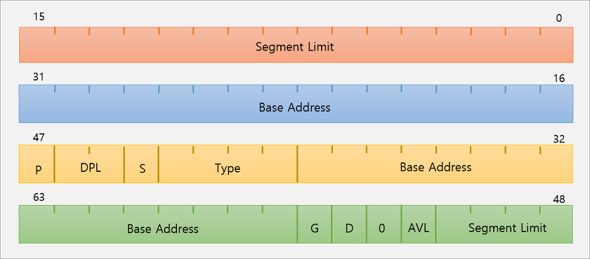

# Summary

- [Introduction](#Introduction)
- [Bios Routines](#Bios-Routines)   
    + [Video Routines](#Video-Routines)    
    + [Disk Routines](#Disk-Routines)
    + [Keyboard Routines](#Keyboard-Routines)
- [Bootloaders](#Bootloaders)
    + [GDT Table](#GDT-Table)
- [Useful information about NASM](#Useful-information-about-NASM)

# Introduction

This directory, contains the source code that is responsible to load the kernel, and gives the execution to it.    
It is loaded by BIOS to the memory address: `0x7C00`.   

# Bios Routines

Since **BIOS** is the firware that is embedded into the mother board, it has full acknowledge of the available hardware.   
So, it provides some abstractions to use in form of routines ...   

- ## Video Routines

    Those routines are an abstraction provided by the BIOS to let programmers interact with VGA.

- ## Disk Routines

    Those routines are an abstraction provided by the BIOS to let programmers read/write from/to disk. 

- ## Keyboard Routines

    Those routines are an abstraction provided by the BIOS to let programmers read input from keyboard.

# Bootloaders

For educational purposes, I am using single boot loader ... Because it is simpler(at least for now ...).   
The bios just load the first **512** of the first sector into memory and gives the execution to it.  

Then, I print some information messages, and load the kernel at the address **0x1000** and gives the execution to it.

- ## GDT Table

    The **GDT** table, is the heart of protected mode ...   
    Since, we start at real mode(full control of the processor and memory), we need to configure the GDT to tell to processor the limits and privilegies from processs(user processes) that will run on the system ...   
    For example, which segment can run code, and, which segment can read/write data.

    In the **Intel/AMD** Architecture, and more precisely in protected mode, most of the memory management and Interrupt Service Routines are controlled through tables of descriptors. Each descriptor stores information about a single object (e.g. a service routine, a task, a chunk of code or data, whatever) the CPU might need at some time. If you try, for instance, to load a new value into a segment register, the CPU needs to perform safety and access control checks to see whether you're actually entitled to access that specific memory area. Once the checks are performed, useful values (such as the lowest and highest addresses) are cached in invisible registers of the CPU.

    Intel defined 3 types of tables: 
    
    - Interrupt Descriptor Table     
    - Global Descriptor Table     
    - Local Descriptor Table. 
    
    Each table is defined as a (size, linear address) to the CPU through the **LIDT**, **LGDT**, **LLDT** instructions respectively.    
    In most cases, the OS simply tells where those tables are once at *boot* time, and then simply goes writing/reading the tables through a pointer.

    **You should always have these items stored in your GDT:**   
    * The null descriptor which is never referenced by the processor.     
    * A code segment descriptor (for your kernel, it should have type=**0x9A**)     
    * A data segment descriptor (you can't write to a code segment, so add this with type=**0x92**)    

    **Example:** A GDT descriptor example!    
    

    **Explanation:**   
    ```txt
    Bits 56-63: Bits 24-32 of the base address
    Bit 55: Granularity - G
        0: None
        1: Limit gets multiplied by 4K
    Bit 54: Segment type - D
        0: 16 bit
        1: 32 bit
    Bit 53: Reserved-Should be zero - 0
    Bits 52: Reserved for OS use - AVL
    Bits 48-51: Bits 16-19 of the segment limit
    Bit 47 Segment is in memory (Used with Virtual Memory)
    Bits 45-46: Descriptor Privilege Level - DPL
        0: (Ring 0) Highest
        3: (Ring 3) Lowest
        Examples: 
            00 -> Ring 0
            01 -> Ring 1
            10 -> Ring 2
            11 -> Ring 3
    Bit 44: Descriptor Bit - S
        0: System Descriptor
        1: Code or Data Descriptor
    Bits 40-43: Descriptor Type - Type
        Bit 43: Executable segment
            0: Data Segment
            1: Code Segment
        Bit 42: Expansion direction (Data segments), conforming (Code Segments. A less privilege code can not execute this segment)
        Bit 41: Readable and Writable
            0: Read only (Data Segments); Execute only (Code Segments)
            1: Read and write (Data Segments); Read and Execute (Code Segments)
        Bit 40: Access bit (Used with Virtual Memory)
    Bits 16-39: Bits 0-23 of the Base Address
    Bits 0-15: Bits 0-15 of the Segment Limit
    ```

- CR0 Control Register

    CR0 is the primary control register. It is 32 bits, any bit means something ...
    
    | Bit | Description | 
    | :-: | :-: |
    | 0 | Protected Environment. If *1*, puts the system into protected mode. *0*(default) the processor is in real mode |

# Useful information about NASM 

The [ORG](https://www.nasm.us/doc/nasmdoc8.html#section-8.1.1) is a special directive, which tells NASM to assume that the program begins at the *address*.    
**Example:**    
```asm
; Tells nasm to assume that the program is at the address 0x7C00
ORG 0x7C00 
```
