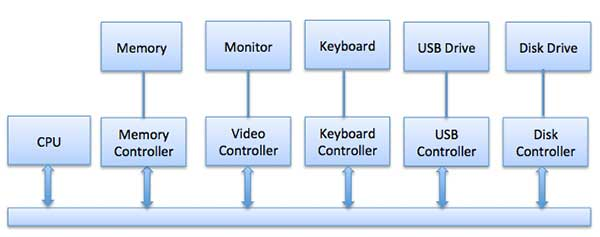

# Summary

- [What is a Operating System Driver](#What-is-a-Operating-System-Driver)

# What is a Operating System Driver

Every device on your computer its built on his own way(it might follow some standars too).   
So, how can the operating system control it?    
For example, we have the driver itself(the hardware), and, a piece of software called **controller** which, is the one who interacts directly with the operating system ...   

**Example:** Device Controller   
